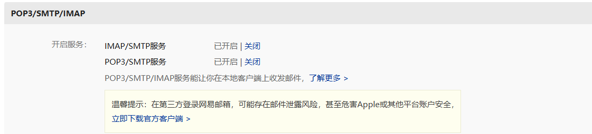
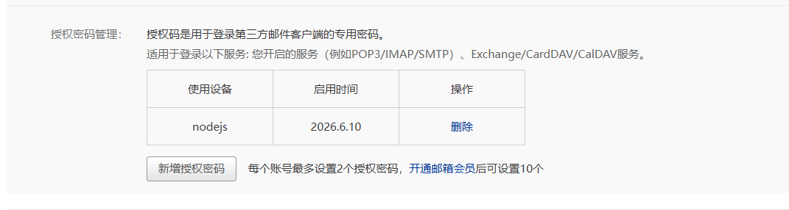

# node.js搭建邮箱验证服务

认证服务需要给邮箱发送验证码，邮箱验证看起来简单，但背后涉及多个耗时环节：格式校验、DNS 查询、SMTP 服务器连接等。Node.js 的**事件驱动、非阻塞 I/O**模型，能让它在等待这些 I/O 操作时不会被"卡住"，而且用到发送邮件的库也很方便

用c++有点麻烦，而且单线程也够了


## 配置环境

先去下载node.js，去[官网](https://nodejs.org/)下就行，下完看看有没有环境变量


新建VarifyServer文件夹，初始化nodejs库的配置文件

在文件夹内打开终端

```
npm init
```

然后根据提示同意就会创建一个package.json的文件


至于这个server如何与我们之前的cserver通信，就需要用到grpc了


然后就是安装各种库

grpc库，安装grpc-js版本

安装的慢用镜像源

```
npm install @grpc/grpc-js
```

安装.proto加载器

```
npm install @grpc/proto-loader
```

安装发送邮件相关库

```
npm install nodemailer
```


然后把之前写的message.proto复制一下放过来

然后写`proyo.js`1解析.proto文件


## 读取配置

在写代码发送邮件之前，我们先去邮箱开启smtp服务。比如163邮箱，在邮箱设置中查找smtp服务器地址，需要开启smtp服务。这个是固定的，不需要修改。

网易163邮箱的 SMTP 服务器地址为: smtp.163.com

发送邮件，建议使用授权码(有的邮箱叫 独立密码)，确保邮箱密码的安全性。授权码在邮箱设置中进行设置。如果开启了授权码，发送邮件的时候，必须使用授权码。




然后再新建一个`config.json` 写一些配置

再写`config.js`去读取配置


另外我们需要一些常量和全局变量，定义一个`const.js`


然后写`emai.js`，封装发送邮件的模块


新建`server.js`，用来启动grpc server


最后在命令行就可以启动server，serve是package.json中的"scripts"

```
PS D:\myproject\C++_project\chat_app\VarifyServer> npm run serve
```


## 验证增加redis库

redis是一个内存数据库，用来存储验证码，因为验证码是临时的，所以用内存数据库比较合适

安装redis库，在根目录下打开终端

```
npm install redis
```


然后新建`redis.js`，封装redis操作

在`config.js`中增加redis配置

在`email.js`中增加redis操作

在`server.js`中增加redis操作，主要是增加验证码时效性