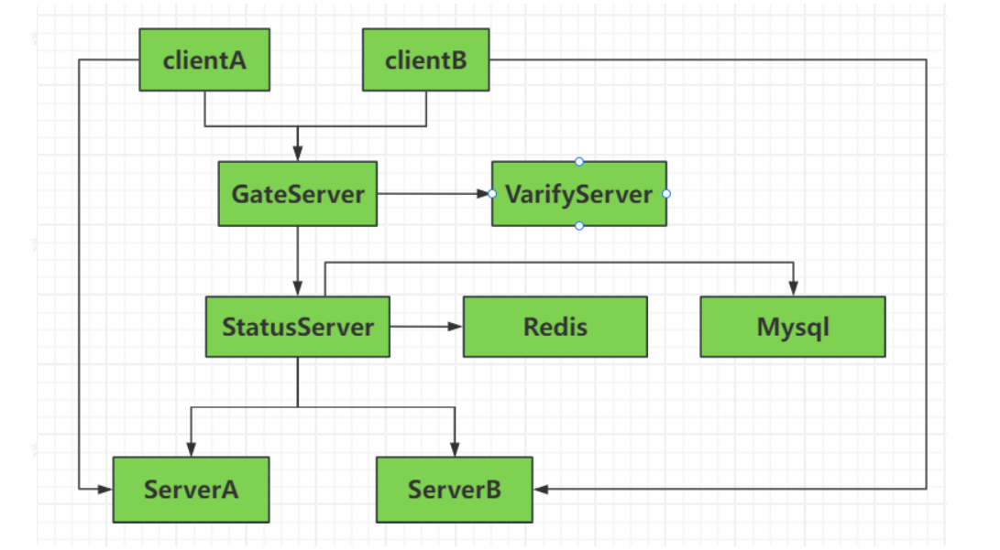
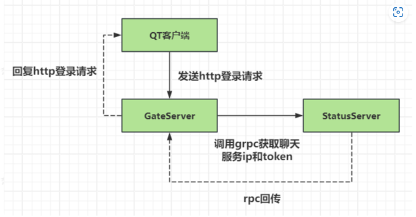

# 全栈聊天室

> PC端Qt界面编程，asio异步服务器设计，beast网络库搭建http网关，node.js搭建验证服务。各服务器之间grpc通信，server和client用asio通信，用户信息的录入

架构设计概要

1，GateServer是网关服务，主要应对客户端的连接和注册请求，因为服务器是分布式，所以GateServer收到用户连接请求后会查询状态服务选择一个负载较小的Server地址给客户端，客户端拿着这个地址去建立连接

GateServer与Qt客户端是HTTP短连接，与grpc服务器长连接

> 有了网关，客户端就不需要知道服务器的地址，只需要与网关通信即可，更加安全，并且可以实现负载均衡

2，用户注册时会发送给GateServer，GateServer调用VarifyServer验证注册的合理性并发送验证码给客户端，客户端拿着这个验证码去GateServer注册即可

3，StatuServer，serverA，serverB可以直接访问Redis和Mysql服务

4，nodejs编写VarifyServer

5，使用Redis实现验证码过期功能，即过期验证码自动删除，key-value 邮箱-验证码

6，使用mysql存储注册信息以及用户信息

7，StatusServer维护着一个实时的 用户状态映射表（例如，存储在内存或 Redis 中），记录了“用户ID -> 其连接的聊天服务器地址和Token”，本质是一个路由器，它通过grpc和chaServer通信

8，GateServer调用grpc获取聊天服务ip和token，StatusServer实现rpc回传给GateServer，从而GateServer知道了聊天服务器的地址和token

9，客户端之间可能不通过同一个聊天服务器通信

10，登录流程，将登录请求发送gateserver，gateserver去statusserver上查询，没问题返回给geteserver一个ip+token，然后gate给到客户端，客户端通过token+ip去与tcp服务器连接，服务器也会去statusserver上查询，没问题tcp服务器给客户端返回一个rsp回包，然后成功登录

用vcpkg做包管理器，十分好用，简单下载grpc库，redis库，mysql库